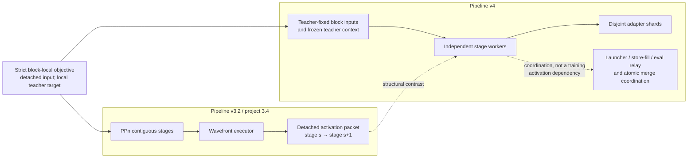
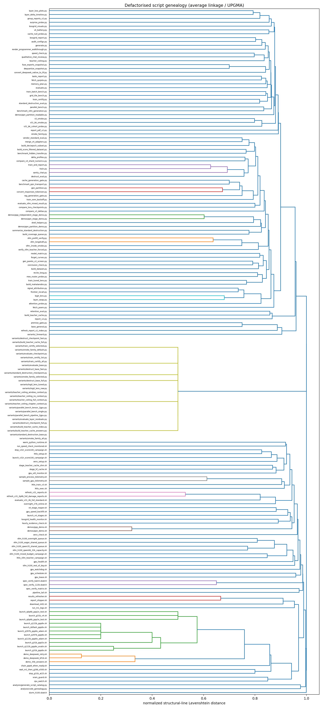

# Defactorised programs: standalone archive, catalogue, and teaching map

`defactorised/` is a mechanically generated, standalone view of the repository's
entry points, plus a small hand-curated teaching layer. It serves two different
uses which should not be confused:

This collection is a **frozen pre-v4-cleanup teaching snapshot**. The live
`src/` tree now contains only the v4 teacher-input protocol; historical v2/v3
programs remain here intentionally for genealogy and demonstrations.

1. **Archival standalones.** Each tracked Python entry point under `scripts/`
   has a same-named copy which does not load code from `src/selfupdate` at run
   time. If the original imports `selfupdate`, its copy embeds a compressed
   snapshot of the package and installs an in-memory importer. Entry points
   which never import `selfupdate` remain ordinary source copies after obsolete
   path bootstraps are removed.
2. **Readable demonstrations.** `demos/` contains deliberately small programs
   for a one-hour architecture walk-through. These expose the relevant control
   and dependency graphs directly instead of asking a reader to inspect a
   repeated encoded package payload.

"Standalone" here therefore means **independent of this checkout's
`src/selfupdate` tree at execution time**. It does not mean that model weights,
datasets, configuration files, Python dependencies, CUDA, or campaign queues
are embedded. The operational mirrors still resolve canonical repository
assets where a second mutable copy would create two sources of truth.

## Where to start

For a one-hour demonstration, start with:

| Time | Program | Question it answers |
|---:|---|---|
| 0–10 min | `demos/PPN_AND_PPP.md` | Why PPn and pipeline-v4 PPP are different architectures |
| 10–25 min | `demos/ppn_partition_readable.py` | How measured block costs become pinned contiguous stage cuts |
| 25–40 min | `demos/ppn_demo.sh` + `demos/ppn_stage_demo.py` | How detached activations form a forward wavefront |
| 40–55 min | `demos/ppp_demo.sh` + `demos/ppp_independent_stage_demo.py` | How independent block shards train and publish without activation handoffs |
| 55–60 min | analysis tables described below | How textual families can be explored without mistaking text for semantics |

`demos/ppn_partition_demo.py` is the bridge from a measured profile file to the
readable partitioner. The flat copies such as `train.py` and `evaluate.py` are
useful for reproducibility or offline inspection, but their embedded package
payload makes them poor slideware.

## Regeneration and scope

Regenerate the Python copies and check that generation is deterministic with
the repository's supported modern interpreter:

```bash
/tmp/$USER/selfupdate-venv/bin/python defactorised/generate.py
/tmp/$USER/selfupdate-venv/bin/python defactorised/generate.py --check
```

The generator also redirects Python child entry points used by training,
certification/cache construction, and the pipeline-v4 battery to their
`defactorised/` counterparts. Embedded module `__file__` values retain the
repo-root depth convention required by provenance logging, without reading the
source package. `shell_helpers.py` replaces shell heredocs which formerly
imported package code:

```bash
python defactorised/shell_helpers.py v4-launch-info BASE.yaml EXP.yaml
python defactorised/shell_helpers.py node-cache-index BASE.yaml EXP.yaml
python defactorised/shell_helpers.py venv-import-check
```

Shell and Slurm details, including the intentionally retained sibling include
for `gpu_lease.sh`, are documented in `README.shell.md`. The shell mapping is
recorded in `MANIFEST.shell.txt`.

## Inventory and purpose catalogue

The [complete per-script catalogue](analysis/SCRIPT_CATALOG.md) says what every
script does and reports its language, category, line count, byte count,
standalone token estimate, and bundle-stripped logic token estimate. The same
178-row inventory is available as
[CSV](analysis/script_catalog.csv) for analysis. It contains 173 user-facing
programs and five generation/forwarding tools; nothing is silently omitted.

The collection occupies 15,754,084 literal source bytes: approximately
3,938,590 GPT-like standalone tokens, or 223,900 script-specific logic tokens
after removing repeated embedded package payloads. These are reproducible
planning estimates, not exact model-tokenizer counts; the method is specified
below and in the catalogue. The following human index groups the same complete
population by role.

### Core execution and training

These are the main train/generate/evaluate entry points and the diagnostics
closest to execution semantics:

```text
attention_probe.py              evaluate.py
base_general.py                 generate.py
cache_null_probe.py             grid_tile_bench.py
memory_plan.py                  merge_v4_adapters.py
model_matrix.py                 moe_router_probe.py
parallel_bench.py               ppn_partition.py
sanity_chat.py                  smoke_family.py
speed_check.py                  surprise_probe.py
teacher_ceiling.py              train.py
train_and_report.py             train_batch_bench.py
train_certify.py                train_oom_backoff.py
train_tuned_lens.py             v31_bk_cohort_probe.py
v31_bk_smoke.py                 v3_smoke.py
```

### Data, teacher caches, conversion, and model preparation

```text
build_dataset.py                         build_deciepoch_subset.py
build_mahalanobis.py                     build_score_filtered_dataset.py
build_teacher_cache.py                   cache_generation_gate.py
convert_deepseek_native_to_hf.py         convert_responses_tokenizer.py
dequantize_snapshot.py                   fetch_poem.py
fetch_quijote.py                         fuse_experts_snapshot.py
rag_generation_gate.py                  vendor_standard_eval.py
```

### Evaluation, comparison, scientific analysis, and reporting

```text
benchmark_hidden_transfer.py             benchmark_ppn_transport.py
benchmark_vllm_generation.py             compare_lora_checkpoints.py
compare_v3_deltas.py                     compare_v4_shard_numerics.py
conclusion_check.py                      delta_profiles.py
destruct_eval.py                         evaluate_vllm_mixed_result.py
forget_curves.py                         frontier_recall.py
group_reports_v2.py                      layer_delta_timeline.py
layer_loss_plots.py                      layer_swap.py
logit_lens.py                            lossgrid_report.py
lossgrid_visuals.py                      premise_gate.py
qualitative_chat_review.py               recite_long.py
refresh_report_v2_index.py               render_programmer_walkthrough.py
report_pdf_v2.py                         report_v2.py
retention_eval.py                        signal_attribution.py
standard_destruction_eval.py             summarize_standard_destruction.py
tasks_report.py
```

### vLLM and distributed verification utilities

```text
vllm_2node_smoke.py
vllm_longdraft.py
vllm_prefill_verify.py
```

### Queue construction and campaign configuration

```text
audit_configs.py
build_coverage_queue.py
gen_pareto_v2_screen.py
```

### Standalone infrastructure

```text
generate.py
shell_helpers.py
```

`generate.py` is both a member of the collection and the reproducible builder
for it. `shell_helpers.py` is generated infrastructure rather than a mirror of
one scientific command.

### Catalogue and genealogy analysis infrastructure

```text
analysis/generate_script_catalog.py
analysis/code_genealogy.py
```

These CPU-only static analyzers generate the inventory/token catalogue and the
textual-distance/linkage artifacts described below. Their generated Markdown,
CSV, and image outputs are analysis products, not additional entry points.

### Shell and Slurm mirrors

The following launchers, monitors, staging tools, and job descriptions mirror
their tracked counterparts. They coordinate processes or environments; they do
not by themselves make a Python program conceptually small.

```text
chain_ppp8_when_ready.sh
cpu_watch.sh
demo_35b_answers.sh
demo_deepseek_bf16.sh
demo_deepseek_retry.sh
download_mlt2.sh
evaluate_v31_4b_full_standard.sh
gpu_health.sh
gpu_lease.sh
gpu_scheduler.sh
gpu_speed_backfill.sh
gpu_util_monitor.sh
gpu_watchdog.sh
hourly_evidence_check.sh
l40s_exec.sh
l40s_setup.sh
l40s_train_v3.sh
l40s_vllm_teacher_campaign.sh
launch_dsflash_ppp8x.sh
launch_g31b_ppp5x.sh
launch_g31b_ppp8x.sh
launch_g31b_v4.sh
launch_q0p6b_ppp2x_test.sh
launch_q0p6b_ppp3x_test.sh
launch_q122b_ppp8x.sh
launch_q122b_ppp8x_adam.sh
launch_q122b_ppp8x_evalin.sh
launch_q397b_ppp8x.sh
launch_q397b_ppp8x_adam.sh
launch_v32r_score100_campaign.sh
launch_v4_stages.sh
lossgrid_health_monitor.sh
overnight_27b_online.sh
pipeline_tail.sh
refresh_v31_0p8b_full_damage_reports.sh
refresh_v31_reports.sh
report_shipper.sh
results_refresher.sh
run_m1_legs.sh
run_speed_check_monitored.sh
sample_gpu_telemetry.sh
sample_process_telemetry.sh
spec_verify_matrix.sh
stage_hf_cache.sh
stage_teacher_cache_shm.sh
stop_g31b_at25.sh
stop_v32r_score100_campaign.sh
v4_stage_reaper.sh
venv_check.sh
venv_setup.sh
vllm_h100_eager_shared_queue.sh
vllm_h100_mixed_budget_campaign.sh
vllm_h100_overnight_queue.sh
vllm_h100_qwen06_32k_capacity.sh
vllm_h100_qwen35_shared_queue.sh
vllm_h100_rest_of_day.sh
vram_guard.sh
wait_m1_then_g26b_e500.sh
warm_python_runtime.sh

slurm_h100.sbatch
spec_verify_122b.sbatch
spec_verify_batch.sbatch
```

### Option-specialised variants

The `variants/` wrappers replace broad option surfaces with named, inspectable
commands. `_forward.py` is their common argument-forwarding helper; it is not a
scientific entry point on its own.

```text
_forward.py
build_teacher_cache_answers.py
build_teacher_cache_full.py
build_teacher_cache_index.py
destruct_base_fast.py
destruct_base_full.py
destruct_checkpoint_fast.py
destruct_checkpoint_full.py
evaluate_base.py
evaluate_checkpoint.py
evaluate_layer_residuals.py
logit_lens_raw.py
logit_lens_tuned.py
parallel_bench_pipeline_2gpu.py
parallel_bench_single.py
parallel_bench_tensor_2gpu.py
smoke_family_all.py
smoke_family_default.py
smoke_family_selected.py
standard_destruction_base.py
standard_destruction_checkpoint.py
teacher_ceiling_chapter_context.py
teacher_ceiling_full_context.py
teacher_ceiling_no_context.py
teacher_ceiling_window_context.py
train_certify_all.py
train_certify_list.py
train_certify_selected.py
```

See `variants/README.md` for the exact pinned options and the corresponding
general command. A variant is a usability projection of a general entry point,
not an independently evolved implementation.

### Curated architecture demonstrations

```text
demos/PPN_AND_PPP.md
demos/ppn_demo.sh
demos/ppn_partition_demo.py
demos/ppn_partition_readable.py
demos/ppn_stage_demo.py
demos/ppp_demo.sh
demos/ppp_independent_stage_demo.py
```

The `.sh` files are part of the architecture demonstrations: concurrency,
failure propagation, sibling termination, and atomic artifact collection are
coordination semantics which a single worker file cannot show.

## Token counts: what the number means

The generated token table reports an **estimated prompt footprint**, not run
time, memory use, cyclomatic complexity, scientific importance, or the number
of tokens processed by a trained model.

Tokenization is model-family dependent. A reproducible table must name the
tokenizer/encoding and its version. When an exact GPT-family tokenizer is used,
the count is the length of that encoding applied to the file's UTF-8 text. If
the analysis also supplies a byte-based approximation, it must be labeled as
an approximation rather than silently mixed with exact counts. Counts can
change after comments, formatting, or embedded payload regeneration even when
behavior is unchanged.

For bundle-bearing standalones, distinguish at least:

- **physical tokens**: the complete file, including the base85-encoded,
  compressed `selfupdate` archive;
- **entry-point tokens**: the visible entry-point source with the generated
  bundle block excluded; and
- **shared package tokens**: the package snapshot which is repeated physically
  in every bundle-bearing file but is conceptually one common body of code.

Physical tokens answer “can I paste this complete standalone into a context
window?” Entry-point tokens answer “how much script-specific logic must a
reader understand?” The curated demos should be compared using their physical
counts because they contain no hidden package payload. This distinction is the
reason a very large archival file can still represent a small entry point—and
why it is usually the wrong file for a one-hour lesson.

The generated [Markdown catalogue](analysis/SCRIPT_CATALOG.md) and
[CSV catalogue](analysis/script_catalog.csv) use the columns `path`, `language`,
`category`, `user_facing`, `lines`, `bytes`, `standalone_file_tokens`,
`entrypoint_logic_tokens`, and `purpose`. Regenerate both with:

```bash
/opt/ohpc/pub/apps/anaconda/anaconda-2025/bin/python3 \
  defactorised/analysis/generate_script_catalog.py
```

## Architectural genealogy: PPn versus pipeline-v4 PPP

The diagram below is a conceptual map derived from execution semantics, not
from filename distance.



### PPn: a forward wavefront

PPn partitions model blocks into contiguous stages. For tile `t`, stage `s+1`
consumes the detached output produced by stage `s`. The admitted partial order
is:

```text
O[s,t] -> O[s+1,t]   downstream progress for the same tile
O[s,t] -> O[s,t+1]   the next tile on the same stage
```

Thus there is an inter-stage training activation boundary even though that
boundary is detached. `demos/ppn_demo.sh` makes the concurrent worker topology
and failure handling visible; its JSON files are pedagogical packets only.
Production same-node transfer is RAM-backed and cross-node transfer uses the
documented high-speed transport, not the demo filesystem protocol.

### Pipeline-v4 PPP: independent layer shards

Pipeline-v4 fixes each block's training input and attention context from the
teacher. Consequently one block's training result is not an input to another
block's training step. PPP stages own disjoint block ranges and publish
independently mergeable adapter shards. The production launcher and relay may
coordinate process startup, teacher store-fill, evaluation, failure handling,
and publication, but those control/evaluation edges do **not** create a PPn
training wavefront.

The compact rule is: **PPn forwards detached training activations; PPP trains
disjoint stage shards independently.** Similar words such as “pipeline,”
“stage,” and numbered PPP configurations are not evidence that one is a renamed
version of the other.

## Textual genealogy: edit-distance matrix and dendrograms

The generated analysis set includes:

- [the population/order table](analysis/artifacts/script_population.csv);
- [the 178×178 normalized edit-distance matrix](analysis/artifacts/edit_distance_matrix.csv);
- [the long-form pair table](analysis/artifacts/pairwise_distances.csv);
- [the average-linkage table](analysis/artifacts/linkage_average.csv); and
- [the rendered dendrogram](analysis/artifacts/dendrogram.png).



Always read the analysis metadata before interpreting a matrix. It must state
whether distance was computed on raw text, normalized source, entry-point-only
text, or decoded package contents; whether line endings and generated bundle
blocks were removed; which edit operation costs were used; and the linkage
method. Without those facts the matrix is not reproducible.

For character-level Levenshtein distance,

```text
d(i,j) = minimum number of insertions, deletions, and substitutions
         needed to transform script i into script j
```

a useful length-normalized value is:

```text
d_norm(i,j) = d(i,j) / max(len(i), len(j))
```

for nonempty files. The expected invariants are `D[i,i] = 0`, symmetry, and
nonnegative finite entries. Verify those properties and verify that the matrix
dimension equals the length of the order table before clustering.

The exact normalization, lexical canonicalization, Myers bit-vector
Levenshtein implementation, validation, and tool versions are recorded in the
[genealogy methods note](analysis/README.md). Regenerate the full set with:

```bash
/opt/ohpc/pub/apps/anaconda/anaconda-2025/bin/python3 \
  defactorised/analysis/code_genealogy.py
```

With SciPy, a precomputed distance matrix must be converted to condensed form;
passing the square matrix directly to `linkage` incorrectly treats each row as
a feature vector:

```python
import pandas as pd
from scipy.cluster.hierarchy import dendrogram, linkage
from scipy.spatial.distance import squareform
import matplotlib.pyplot as plt

dist = pd.read_csv("defactorised/analysis/artifacts/edit_distance_matrix.csv",
                   index_col=0)
assert list(dist.index) == list(dist.columns)
condensed = squareform(dist.to_numpy(), checks=True)
tree = linkage(condensed, method="average")
dendrogram(tree, labels=dist.index.tolist(), leaf_rotation=90)
plt.tight_layout()
plt.show()
```

`average` linkage is a reasonable descriptive default for arbitrary textual
families. Ward linkage should not be applied mechanically to edit distances:
its variance interpretation assumes Euclidean observations. Report the metric,
normalization, linkage rule, and leaf order with every dendrogram. Bootstrap or
perturbation stability is preferable if clusters will support more than
navigation.

### Expected and misleading clusters

Named option variants should cluster tightly with their forwarding helper and
sibling variants. Shell launchers for related campaigns may cluster because
their command templates differ by only a few flags. Bundle-bearing Python
files may cluster overwhelmingly by their repeated encoded payload, concealing
the entry-point differences a human actually cares about. For that reason, the
entry-point-only/normalized matrix is the useful default for navigation, while
the raw physical matrix remains an auditable description of the files as
stored.

Most importantly, **edit distance measures textual homology only**. It is not:

- an import or execution-dependency graph;
- evidence that two programs are numerically equivalent;
- a measure of shared scientific assumptions;
- a chronology or commit ancestry; or
- proof that one architecture descended from another.

Use imports, subprocess calls, and launcher relations to build an execution
graph. Use configuration contracts and training data flow to describe the
scientific architecture. Use Git history for chronology. The Mermaid diagram
above comes from those semantic sources; the dendrogram is a separate textual
navigation instrument.

## Reproducibility checklist

Before publishing or presenting this directory:

1. Run deterministic generation and its check mode.
2. Verify every tracked `scripts/*.py`, `scripts/*.sh`, and `scripts/*.sbatch`
   entry point has the expected mirror or an explicit manifest exception.
3. Verify no generated Python mirror adds or reads `src/selfupdate`.
4. Regenerate inventory, token, distance, linkage, and visualization artifacts
   with tool versions and normalization metadata recorded.
5. Check matrix order, symmetry, diagonal zeros, and finite values.
6. Run the CPU-safe PPn and PPP demos; do not treat them as campaign or GPU
   certification.
7. Keep the architecture genealogy and edit-distance dendrogram labeled as
   different kinds of evidence.

This collection is best understood as three layers: complete mechanical
standalones for portability, named variants for reduced option surfaces, and
small demonstrations for human comprehension.
