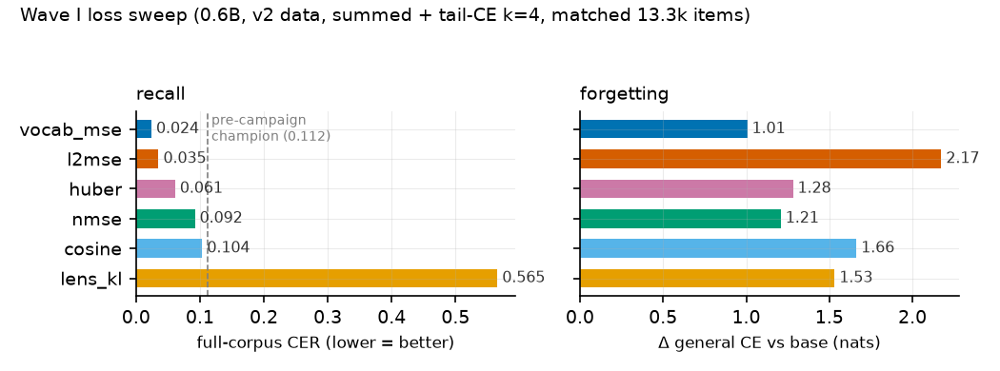
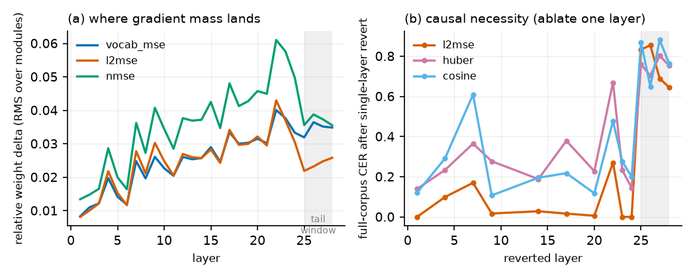
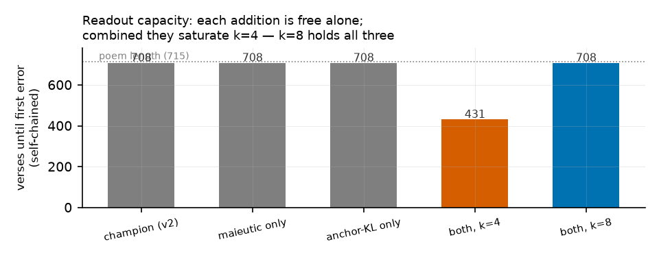
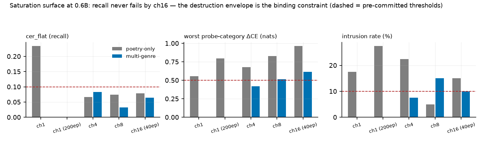
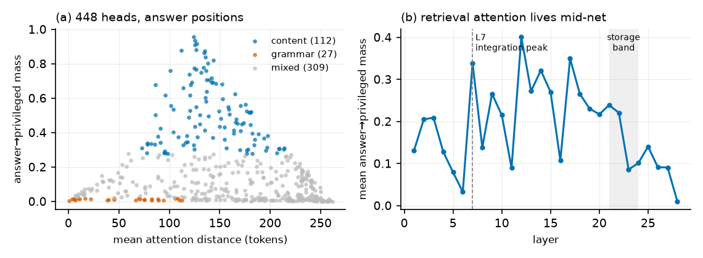
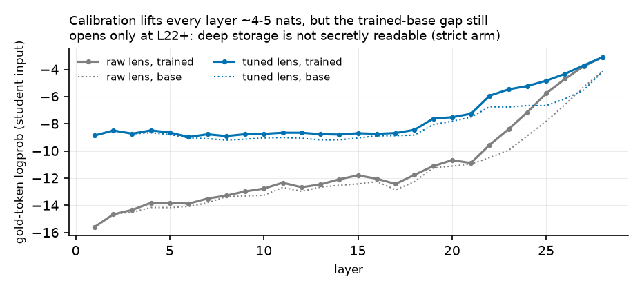
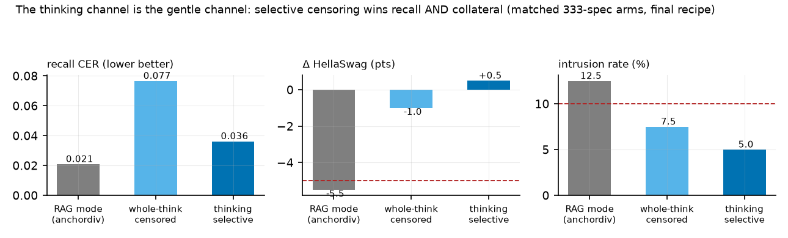
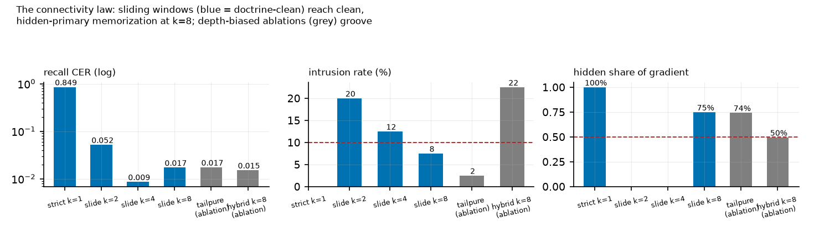

# Forward-Only Trajectory Matching: Distilling Context into Weights, One Layer at a Time

**The Pierre Menard Program, Stage 1 — campaign report, 2026-07-04**

*selfupdate / layerwise branch · Qwen3-0.6B → 20B-class · repository:
`supercomplex/selfupdate_lw`*

---

---

> **ERRATUM & RECLASSIFICATION (2026-07-05).** Every arm in this report
> trained its readout window with cross-entropy (log loss) against the
> *original text* — task supervision, not distillation. The mechanism was
> always disclosed (the term was named "tail-CE") but misframed as part of
> the distillation method. All Campaign-1 arms are hereby reclassified as
> **hybrid baselines** (task-label readout, ~25% of gradient by measured
> attribution). Storage results (per-layer trajectory matching, the lens
> and chimera analyses, localization) are unaffected: those gradients never
> saw the reference text. Campaign 2 (addendum below) established the
> corrected method — uniform sliding windows, teacher-sourced everywhere
> except an irreducible, bounded reference term whose necessity is now a
> measured law (the "last 3%", C2-34) and which corresponds, in the
> deployment setting, to CE on the teacher's own transcript. Markers
> reading "[expunged]" record a schedule removed under damnatio memoriae:
> its readout ignored configuration and trained on the reference
> unconditionally, invalidating it even as a baseline. One further
> terminology correction applies throughout: what this report called
> "gold" is the evaluation reference; it was never a legitimate training
> target.

---

## Abstract

We study a training regime in which a language model teaches itself a
long text: the same model plays teacher (prompt contains a privileged
RAG passage) and student (passage removed), and each student block is
trained to reproduce the teacher's hidden state at its own depth, with
every backward pass confined to a single block. We call the regime
**forward-only trajectory matching**: because teacher and student share
architecture and initial weights, the teacher's forward pass *is* the
supervision trajectory, sampled at every layer, with no global backward
anywhere in the system except one explicitly bounded top window. In a
24–40 h autonomous campaign (~50 runs, Qwen3-0.6B/1.7B plus five other
model families) we find: (1) a new storage loss — MSE measured through
the frozen unembedding's Gram matrix (`vocab_mse`) — beats standard
hidden-matching losses on recall *and* forgetting, and writes storage in
a format portable across readouts; (2) memory storage and behavioral
readout dissociate causally: storage is distributed and redundant at
~80% fractional depth, while all pathologies of the regime live in the
top-*k* readout window — it is fragile, template-locked, intrusion-prone,
and capacity-limited; (3) "catastrophic remembering" — damage
concentrated on the memorized content's genre neighbors — is a distinct,
measurable failure mode, halved by a KL-to-base anchor through the
readout window and *worsened* by a naive CE anchor; (4) Socratic
("maieutic") dialogue frames at additive data budget cure the readout's
template lock completely while improving plain recitation; and (5) the
readout window has a measurable capacity: k=4 supports any two of
{elicitation diversity, anchor discipline, full-poem chain depth}, k=8
supports all three. The final 0.6B model recites the complete 715-verse
*La tierra de Alvargonzález* self-chained with its first error at verse
708, answers dialogue-framed questions at 100% exact lines, and pays
+0.51 nats mean general-CE — with the storage phase trainable one block
at a time, the contract required for streaming this method to
120B-class models.

---

## 1. Introduction

Standard knowledge distillation and fine-tuning assign credit through a
full-depth backward pass. That coupling is what makes very large models
expensive to update: the whole network must be resident and connected.
This work asks how much of a concrete memorization task — verbatim
recall of a 715-verse poem, elicited without any retrieval context —
survives when credit assignment is **strictly block-local**.

The setting makes locality unusually cheap. Teacher and student are the
*same* checkpoint; the teacher sees `shared_prefix | privileged |
shared_mid | answer` while the student sees the same prompt with
`privileged` deleted. At every aligned token position and every layer
`L`, the teacher's hidden state `h_L` is a well-defined vector *in the
student's own coordinate system* — no learned projection, no auxiliary
head, no label. Each student block trains against its own depth's
target from a detached input; activations are detached both entering
and leaving the block.

Contributions, in the order the campaign produced them:

1. **A vocabulary-metric storage loss.** `vocab_mse` measures hidden
   error as `‖W·Δh‖²` through the frozen unembedding `W` — equivalently
   a quadratic form under the Gram matrix `M = WᵀW`, computable with one
   4 MB buffer. It is the flat local approximation of a per-layer KL
   through the logit lens, and it wins the loss sweep on every axis
   (Fig. 1).
2. **A causal map of where the memory lives** (Fig. 2): entry ~layer 7,
   redundant distributed storage at ~80% fractional depth, readout at
   the top; confirmed by weight-delta profiles, single-layer
   graft/ablate curves, logit-lens depth profiles, and cross-run
   delta-direction convergence.
3. **Readout transplants ("chimeras")** showing storage formats are
   loss-specific and `vocab_mse`'s is portable — which predicted a
   **two-phase pipeline** (`[expunged]`) where a readout trained on a
   *frozen, fully-locally-trained* body beats joint training.
4. **Catastrophic remembering** as a measurable failure mode with a
   4-probe decomposition (drift vs intrusion), a demonstrated fix
   (anchor-KL) and a demonstrated anti-fix (anchor-CE) (Fig. 3).
5. **Maieutic data**: dialogue-framed elicitation examples that cure the
   readout's template lock at additive budget.
6. **Readout capacity** as a budgetable quantity (Fig. 4).

## 2. Related approaches and alternatives

**Whole-network KD** (Hinton-style) matches the teacher's output
distribution and needs full-depth backward — the baseline this branch
deliberately abandons. **Forward-Forward** trains layers on a local
scalar goodness with positive/negative data, but provides no per-layer
vector target. **Greedy layerwise training** (Bengio 2007; Belilovsky
2019) reaches the global label through per-stage auxiliary heads.
**Target propagation** manufactures local targets with learned inverses,
inheriting their approximation error. None exploit the condition that
makes our targets exact and free: teacher and student sharing
architecture *and* initialization, so every depth's target already lives
in the student's coordinates.

Within the design space we also evaluated and rejected alternatives:
per-layer **lens-KL** as the storage loss (killed: 23× champion CER at
~5× compute; the unembedding only decodes final-layer geometry, so
inner-layer distribution matching is noise with a gradient); **CKA-style
rotation-invariant losses** (rejected analytically: batch-1 `[A,H]`
slices are rank-deficient, and rotation invariance contradicts the
frozen-readout contract); **teacher-stream-only routing**
(`teacher_censored` alone never recites — the student must finish
training on its own input distribution); **catechism drills at matched
budget** (substituting drill items for recitation items undertrains
recitation; elicitation diversity must be additive); and **anchor-CE**
(Section 6.2).

## 3. Method

### 3.1 Masking and alignment

Every example is segmented `shared_prefix | privileged | shared_mid |
answer`. The RAG passage (the relevant poem fragment with context
padding) is the privileged block; the aligned span is
`shared_mid + answer`. The student-side block is deleted
(`compaction: remove`). Qwen3 uses RoPE with full attention, and a
constant position offset is output-invariant, so all teacher/student
divergence at aligned positions is attributable to attention into the
privileged block — precisely the signal being distilled. A
template-agnostic re-renderer (`chatfmt.py`) derives the segment pieces
for any tokenizer's chat template, which is what lets the same records
drive Llama, Mistral, Phi and gpt-oss unchanged.

### 3.2 Losses

Geometric hidden-matching kinds, per aligned position:

- `nmse`: `mse(h_s, h_t) / mean(h_t²)` — scale-comparable across layers.
- `l2mse`: MSE between L2-normalized vectors (direction only).
- `cosine`: `1 − cos(h_s, h_t)` (direction only, linear near optimum).
- `huber`: smooth-L1 in units of the teacher RMS.

Vocabulary-metric kinds decode through the **frozen** final norm + head:

- `vocab_mse`: `‖W·Δh‖² / ‖W·h_t‖²` = `ΔhᵀMΔh` with `M = WᵀW`
  precomputed once ([H×H], fp32). MSE in logit space at hidden-space
  cost.
- `lens_kl`: full `KL(lens(h_t) ‖ lens(h_s))` per position — the exact
  objective whose local quadratic approximation (Fisher pullback
  `Wᵀ(diag(p) − ppᵀ)W`) `vocab_mse` flattens.

**Frozen-vocabulary principle.** The embedding, final norm and LM head
are never trained, under any schedule or auxiliary: they are the fixed
basis every lens and every cached target is expressed in (and on tied
models the logit matrix *is* the embedding transpose). This is enforced
four ways: `requires_grad=False`, block-only optimizers, gradient-
confinement tests, and a runtime signature tripwire that refuses to
save a checkpoint if these tensors changed. Verified bitwise on trained
checkpoints (max |Δ| = 0.0).

### 3.3 Schedules (input routing)

- `summed`: block L consumes the student's own (drifting) stream,
  detached; every block gets its local loss on every item.
- `sequential`: one block trains to plateau at a time over a frozen
  prefix — the one-block-at-a-time streaming contract.
- `teacher_censored`: block L consumes the *teacher's* `h_{L−1}` with
  privileged rows deleted (teacher position ids kept). Inputs are
  stationary and layers independent — embarrassingly parallel.
- `mixed`: per-item Bernoulli between the two streams with the
  teacher-branch probability annealed 1→0 over epochs (scheduled
  sampling across depth).
- `[expunged]`: body frozen (from `init_from`), only the top-k window
  trains — phase 2 of the two-phase pipeline.

### 3.4 Readout auxiliaries

Strict hidden matching stores but does not recite (Section 5.2). The
bounded concession is **tail-CE**: the final `k` blocks train as one
connected graph so a gold-answer CE at the top can assign credit within
the window; everything below stays block-local. The **anchor**
regularizes the same window on neighbor-genre Spanish fragments once per
optimizer step: `anchor-CE` (next-token CE — a recorded negative) or
`anchor-KL` (`KL(base ‖ student)` against precomputed base-model
logits — the corrected form).

### 3.5 Data

`v2` (333 examples): sliding recitation windows, sections, paraphrased
templates, long windows (24/48 verses). `v3` (+catechism drills):
follow/precede/cloze/anchor Q&A. `v4` (+**maieutic frames**, 141): five
rotating Spanish dialogue templates (Socratic exchange, classroom scene,
missing page, citation check, small talk) that *elicit* verse windows;
answers stay verbatim verses so all masking/eval machinery is unchanged.

### 3.6 Metrics

Full-corpus recitation CER and line-exact fraction (never the 8-example
training subset); whole-poem chained recitation (anchored and
self-chained; verses until first error, out of 715); **forgetting** as
Δ general-CE vs per-model base references on four held-out probes
(Spanish romantic poetry, Spanish facts, English prose, Spanish
procedural text), whose *profile* separates uniform drift from
genre-targeted **intrusion**; and elicitation generalization (CER on the
141 maieutic frames).

## 4. Experimental setup

Qwen3-0.6B (28 layers) for mechanics; Qwen3-1.7B/4B/8B, Llama-3.1-8B,
Mistral-7B-Instruct, Phi-4-mini-reasoning, gpt-oss-20b (MoE) for scale
and generality; 4× NVIDIA L40S (46 GB). Full fine-tuning at 0.6B/1.7B
(fp32 masters, bf16 autocast, one optimizer per block); LoRA r16 with
the **online teacher** (adapters-off = frozen teacher, no disk cache)
for ≥4B and non-Qwen families. Matched item budgets throughout (40
epochs × 333 = 13,320 items on v2; the v4 arm is explicitly additive at
18,960). Teacher hidden states via fp16 per-layer disk caches
(hash-keyed by model+data+mask) or computed online. All runs, metrics
and evals are in the repository (`runs/results.md`, `runs/report.pdf`).

## 5. Results

### 5.1 The loss decides what is written, not just how fast

*Figure 1: Wave I loss sweep at the champion operating point.
`vocab_mse` wins recall (CER 0.024 vs incumbent 0.112) and pays the
least forgetting of any tail arm. `l2mse` posts strong recall but the
worst forgetting; `lens_kl` is Pareto-dominated at ~5× compute.*

Weight-space analysis sharpens the claim: delta-direction cosine across
runs shows huber≈nmse are the *same* trajectory (0.95–0.99), l2mse
nearby (0.87–0.91), while `vocab_mse` writes a substantially different
solution (0.48–0.70 vs all others) — and the best one. Measuring error
as the vocabulary sees it changes *what* is stored.

**Portability (chimeras).** Transplanting the k=4 readout between
checkpoints of different losses is asymmetric: a foreign (l2mse) readout
decodes `vocab_mse`'s body almost as well as its own (CER 0.109 vs
0.024), the reverse fails (0.595), and a readout grafted onto a
*strict-only* body that never recited alone (0.85/0 %) unlocks 40 %
exact lines. Each loss writes storage in its own format; the Gram
metric writes in the one format every readout natively consumes.

### 5.2 Where the memory lives

*Figure 2: (a) weight-delta mass concentrates at L22–24 of 28 (~80 %
fractional depth — the same fraction at 1.7B), with a local bump at the
L7 context-entry point. (b) Reverting single layers below the tail
barely hurts (l2mse survives reverts of its two most-modified layers at
CER 0.00) — storage is redundant. Reverting any one tail block destroys
recitation — the readout is a fragile co-adapted circuit.*

Logit-lens depth profiles agree: the gold token is undecodable through
L1–20 and assembles steeply from L22 — including in strict runs that
never recite, proving storage exists without behavior. At fixed loss,
tail and strict runs share their sub-tail weight deltas almost exactly
(cos 0.99+): tail-CE re-carves only the readout, never the storage.

**Two-phase training.** These facts predict that the readout can be
trained *after* storage, on a frozen body. It can: `[expunged]` on a
frozen strict-trained body reaches CER **0.008** — better than joint
training (0.024) — turning the whole pipeline into an embarrassingly
parallel storage phase plus one bounded window phase.

### 5.3 Routing

Pure teacher-stream training (`teacher_censored`) never produces
recitation (CER 0.84–0.87) regardless of backend; the annealed `mixed`
curriculum recovers champion-level subset recall (full CER 0.110) with
the least forgetting of the v2 arms (+0.74). The student must finish
training on its own input distribution; stationary teacher inputs are a
storage device, not a behavior device.

### 5.4 Scale and families

At 1.7B the readout window does **not** need to grow (k=2 reaches CER
0.087 after a late convergence; k=4 0.075; k=8 0.042), and the loss
ranking is scale- and axis-dependent: l2mse wins raw recall at 1.7B
(0.012) but with the worst intrusion profile (+3.57 on the poetry
probe). The same code drives **Mistral-7B** to near-champion recitation
(0.054, LoRA online) and trains Llama-3.1-8B and Qwen-4B/8B with no
family-specific changes. **Reasoning-tuned models resist the recipe**
(Phi-4-mini 0.918; gpt-oss-20b 1.0 after harmony-aware eval
normalization): their output routes through think/analysis channels the
readout window never trains — the sharpest open question for scaling.

### 5.5 Catastrophic remembering and the anchor arc

*Figure 3: per-probe forgetting decomposition on [expunged] arms of equal
recall. Damage concentrates on the memorized content's nearest genre
neighbor (Spanish romantic poetry) — intrusion, not drift. A naive CE
anchor on six fixed neighbor fragments amplifies it (the regularizer
becomes another memorized poem); KL-to-base through the window halves
it.*

Strict (storage-only) arms show a *flat* damage profile: the intrusion
trigger is installed by readout training. Qualitatively, tail-trained
checkpoints continue a Bécquer prompt with Machado material (violet-
mountain imagery, the mother's death) while the base model merely
repeats itself. The metrology is cheap — four forward passes — and we
propose reporting *both* the mean ΔCE and its profile for any
memorization fine-tune.

### 5.6 Elicitation brittleness and the maieutic cure

The v2 champion collapses from CER 0.024 to **0.921** when the same
verses are requested through dialogue frames it never saw: the readout
is template-locked. Adding 141 maieutic frames (additive budget) yields
CER **0.000 (100 % exact)** on dialogue elicitation *and improves* plain
recitation to 0.015. At 1.7B the effect transfers unchanged (dialogue
0.000). Elicitation diversity trains the readout's triggers, not the
storage — consistent with the storage/readout decomposition — and must
be *additive*: substituting drills for recitation at matched budget
(v3) undertrains recitation (0.711).

### 5.7 Readout capacity and the final recipe

*Figure 4: whole-poem self-chained recitation. Maieutic data and
anchor-KL are each free individually (708/715 verses to first error),
but combined they saturate the k=4 window (431 one-phase, 231
two-phase). Widening to k=8 restores 708 while keeping every other
gain.*

**Final recipe** — `vocab_mse` + maieutic v4 + tail-CE **k=8** +
anchor-KL 0.5:

| axis | value |
|---|---|
| recitation (full corpus) | CER 0.015 / 98.6 % exact |
| dialogue elicitation | CER 0.001 / 100 % exact |
| whole poem, self-chained | CER 0.007, first error at verse 708/715 |
| poetry-neighbor intrusion | +0.65 nats (campaign best) |
| mean forgetting | +0.51 nats (campaign best) |

Seed-replicated (k=4 one-phase variant: 0.009 @ s17, 0.012 @ s43); at
1.7B the recipe scores 0.021 — 3.5× better than the plain champion
recipe at the same scale.

## 6. Negative results (kept on purpose)

1. **lens_kl** as storage loss: Pareto-dominated; inner-layer lens
   distributions are miscalibrated because the unembedding only decodes
   final-layer geometry.
2. **anchor-CE**: fixed-fragment CE is memorization pressure — it
   *increased* poetry-neighbor damage from +2.29 to +3.57 nats.
3. **teacher-stream-only routing**: stores but never recites.
4. **catechism at matched budget**: elicitation diversity by
   substitution undertrains recitation; it must be additive.
5. **LoRA as forgetting protection**: Qwen-8B LoRA still pays +1.30
   nats; the adapter bound does not prevent intrusion.
6. **Reasoning-tuned families**: the recipe fails on think/analysis-
   channel models as-is.

## 7. Limitations and future work

Single poem, single language, one model lineage fully mapped (Qwen3) —
the causal picture should be replicated on a second corpus before the
fractional-depth claims harden. The window-capacity result (k=4 holds
two of three demands, k=8 all three) begs a scaling law: capacity as a
function of k, model width, and content size — the Don Quijote question
in miniature. The designed-but-unbuilt `thinking_selective` mask
(censor only quoted verses inside reasoning traces, keep free
deduction) is now doubly motivated by the reasoning-family failure.
The tuned-lens program (per-layer translators for calibrated depth
profiles) remains open, as does a broader rotating anchor corpus.

## 8. Conclusion

With exact per-depth targets from a shared-initialization teacher,
block-local training stores a 715-verse poem redundantly and portably;
a bounded top window turns storage into behavior; and every pathology
of the process — template lock, genre intrusion, capacity saturation —
lives in that window, where it can be measured, priced, and fixed. The
storage phase never needs more than one block in memory. Pierre Menard,
Stage 1, closes at 0.6B with the poem recited whole; the machinery that
did it is the same machinery designed to stream one block of a
120B-class model at a time.

---

*Artifacts: `EXPERIMENTS.md` (closing table and chronology),
`runs/report.pdf` (per-run appendix; archived copy alongside this
paper), `runs/results.md`, `runs/curves.png`, `runs/forget_curves.png`,
`docs/hidden_loss.md`, `docs/forward_trajectory.md`. Figures reproducible
via `paper/make_figs.py` from run artifacts.*

---

# Campaign 2 Addendum (2026-07-05): The Corrected Method and Its Laws

## The four laws (method definition)

1. **Sliding windows over all blocks.** Connected credit is uniform:
   every block is updated inside k-deep windows sliding over the whole
   depth (`conn_window k / conn_stride 1`); the top window carries the
   readout term only because logits exist there. Tail-only training is
   classical distillation in costume and is banned.
2. **The vocabulary never trains.** Embedding, final norm, unembedding
   are frozen under four locks and a runtime tripwire; they serve as
   per-layer measuring devices, never as entry points.
3. **Depth uniformity.** No training signal may grow toward the output;
   depth-biased behavioral terms are the tail in disguise, and
   empirically they are the intrusion direction (fisher 57.5%, deep
   lens-CE 50%, lens_kl-as-hidden-loss 90% intrusion).
4. **Never train logits toward the original text** — with the one
   measured exception below. Eval against the reference is the metric;
   training toward it is task supervision (kd-branch territory). Every
   arm ships a gradient-attribution number.

## The recipe (crowned 2026-07-05)

`vocab_mse` trajectories at every depth + sliding k=8 windows +
**mimicry-free top window** (no in-window hidden matching; C2-22) +
bounded reference-CE (weight 0.5; 15.6% of gradient — the arm is 84.4%
trajectory-driven) + multi-genre anchor-KL:
**CER 0.007 / 99.3% line-exact / all destruction thresholds passed**
(probes ≤ +0.18, benchmarks ≥ −1.5, intrusion 5.0%). Best arm of the
program, and the most trajectory-driven performer measured.

## The last-3% law (why the reference term is irreducible)

Replacing the reference-CE with KL toward the teacher's own logits
(`teacher_kl`) converges the readout to the teacher's label agreement
*exactly* (97.3% vs the reference) — and free-running recitation
compounds the residual 3% into collapse (CER 0.801). Verbatim recall
lives in precisely the information the teacher's distribution lacks:
its own reading errors. Pure distribution matching transfers in-context
competence; exactness requires the reference — in deployment, the
reference is the teacher's own generated transcript, restoring purity
by construction. Corollary condition: teacher_kl transmits only what
the teacher knows in its context (thinking-mode teachers without the
passage starve the readout; premise-check per data mode).

## Selected Campaign-2 results (full table: EXPERIMENTS.md)

- **Destruction metrology v2** (category probes, standard-benchmark
  CE-ranking, intrusion bait, degeneration; pre-committed thresholds)
  reversed Campaign 1's forgetting claims: anchors had been protecting
  only their own genre (anchor-Goodhart); the C1 "final recipe" is
  destructive under honest instruments.
- **Dilution beats drilling**: co-residence of two corpora is free
  (poem at champion recall beside Quijote ch1, CLEAN both seeds);
  overtraining a small corpus to perfection buys 27.5% intrusion.
- **Saturation is collateral, not capacity**: 16 chapters of the
  Quijote store and address fine at 0.6B; the capability envelope, not
  recall, is what breaks.
- **The thinking channel is the gentle channel**: censoring only
  verbatim quotations inside the model's own traces beats whole-trace
  censoring on recall with near-zero capability cost.
- **Teacher ceilings are flat in scale** (0.45–0.67, 0.6B→14B):
  consolidated recall beats with-passage prompting 30–70× at every
  size — the students exceed their teacher's writing because they
  distill its reading.
- **LoRA is the wrong vehicle** for full-body consolidation: benchmark
  damage (−12 to −18 points at 4–8B) survives anchor, learning-rate,
  and rank interventions; full-FT windows with CPU-paged optimizer
  state (`offload_adam`, bitwise-verified) replace it — full-FT 4B
  trains in ~30 GB at 2.3 s/item where classical training needs ~64 GB.
- **Parallelism**: two-card pipeline evaluation is validated; two-card
  pipeline *training* failed its bit-honesty repro (0.837 vs 0.015)
  and is the first Campaign-3 blocker. Figures 5–9 cover the
  saturation surface, head taxonomy, tuned-lens validation,
  thinking-channel comparison, and the connectivity law.

*Fig. 5 — the saturation surface: recall never fails by ch16; the destruction envelope is the constraint.*

*Fig. 6 — content heads live mid-net (L7–L20); the readout tail retrieves nothing.*

*Fig. 7 — calibration lifts every layer; the trained-base gap still opens only at L22+.*

*Fig. 8 — the thinking channel is the gentle channel.*

*Fig. 9 — the connectivity law: uniform sliding windows reach clean, trajectory-primary memorization at k=8.*

**Appendix casebook:** per-method characteristics, stats (time, VRAM,
item budget, most-altered layers, gradient attribution) and verbatim
model transcripts for ten representative arms: `docs/casebook.md`.
A method-invariant regularity: every performing arm writes its storage
at layers 17–22; failing arms scatter (shallow vandalism at L6 for the
label-only control, deep grooves at L25 for teacher-stream) — where the
writes land predicts whether the method worked.

*Figures 5–9 in `paper/figs/`; fig3 was removed with its expunged arms.
Instruments, laws, and the closing table: `EXPERIMENTS.md`. Doctrine:
`CLAUDE.md`; window semantics: `docs/windows.md`; the program's
destination: `docs/evolving_person.md`.*
